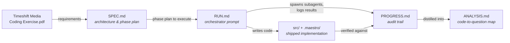

# Wordle — Timeshift Media coding exercise

A React Native + TypeScript Wordle implementation, runnable on iOS and web from a single codebase. Built on Expo SDK 56 (React 19.2, RN 0.85, expo-router file-based routing, react-native-web 0.21).

The exercise prompt lives in [`Timeshift Media Coding Exercise.pdf`](./Timeshift%20Media%20Coding%20Exercise.pdf). Answers are inline below in [Exercise questions, answered](#exercise-questions-answered).

---

## Get started

```bash
bun install

# unit tests (engine + dev-seed)
bun run test

# web (chromium)
bun run web                 # http://localhost:8081
# seed for testing: http://localhost:8081/?answer=apple

# iOS simulator
bun run ios
# seed for testing: open the deep link `makeshiftmedia://seed/apple`
```

`bun` is the package manager; `npm`/`yarn` work too if you prefer.

## What's in the repo

| Path                          | Purpose                                                                              |
| ----------------------------- | ------------------------------------------------------------------------------------ |
| `src/game/types.ts`           | `BoardState`, `SubmittedGuess`, `LetterStatus`, `GameStatus`, `SubmitResult`         |
| `src/game/engine.ts`          | `createBoard`, `validateGuess`, `applyGuess`, `submitGuess` — pure, no React         |
| `src/game/engine.test.ts`     | 19 ts-jest cases (positive + negative, incl. the `ALLOY` vs `ALOHA` duplicate trap)  |
| `src/game/wordlist/`          | 300 answers + 3512 allowed guesses, embedded as TS arrays                            |
| `src/features/wordle/`        | `useWordle` hook + presentational `Board`/`Row`/`Tile`/`Keyboard`/`StatusBanner`/... |
| `src/app/index.tsx`           | Mounts `<WordleScreen />` at the root tab                                            |
| `.maestro/`                   | Six E2E flows (win/loss/invalid × iOS/web). See `.maestro/README.md`                 |
| `SPEC.md` / `RUN.md`          | Spec-driven dev plan + orchestrator prompt used to build this (see workflow below)   |
| `PROGRESS.md` / `ANALYSIS.md` | Audit trail of the four implementation phases and a code-to-question mapping        |

---

## Exercise questions, answered

The PDF asks four questions. Below is the direct answer to each, with the canonical file reference.

### Q1 — Data type representing the Wordle board

`BoardState` in [`src/game/types.ts`](./src/game/types.ts) captures both in-progress and terminal state:

```ts
export type LetterStatus = 'correct' | 'present' | 'absent';
export type KeyStatus = LetterStatus | 'unused';
export type GameStatus = 'in_progress' | 'won' | 'lost';

export interface EvaluatedTile {
  letter: string;
  status: LetterStatus;
}
export interface SubmittedGuess {
  tiles: EvaluatedTile[];
}

export interface BoardState {
  answer: string;                          // lowercase, length === wordLength
  wordLength: number;                      // 5
  maxGuesses: number;                      // 6
  guesses: SubmittedGuess[];               // submitted only — never the in-progress row
  status: GameStatus;                      // in_progress | won | lost
  keyStatuses: Record<string, KeyStatus>;  // aggregate 'a'..'z' state for the keyboard
}
```

`status` answers "is the game complete, and was it won or lost." `guesses` carries the full move history with per-tile colouring. `keyStatuses` is the precomputed aggregate the on-screen keyboard renders from.

### Q2 — `(board, guess) → newState` function

[`src/game/engine.ts`](./src/game/engine.ts) exposes three layers; the top one is the answer:

```ts
submitGuess(board: BoardState, raw: string, wordSet: ReadonlySet<string>): SubmitResult
```

`SubmitResult` is a discriminated union covering every state the PDF lists:

| PDF state                                                | Engine return                                                                              |
| -------------------------------------------------------- | ------------------------------------------------------------------------------------------ |
| (a) Correct guess, game complete                         | `{ ok: true, transition: 'won',     board: { status: 'won',  ... }, evaluation }`          |
| (b) Incorrect guess, remaining guesses, letters used... | `{ ok: true, transition: 'continue', board: { status: 'in_progress', keyStatuses, ... } }` |
| (c) Incorrect guess, game over                           | `{ ok: true, transition: 'lost',    board: { status: 'lost', ... }, evaluation }`          |
| Invalid input / submission after game end                | `{ ok: false, error: 'too_short' \| 'not_in_word_list' \| 'game_over' }`                   |

Under the hood, `submitGuess` = `validateGuess` (length + dictionary check) → `applyGuess` (the pure reducer that does the two-pass evaluation). They're split so the UI can shake the row on an invalid word without touching board state. Implementation detail: duplicate-letter handling does a greens-first pass that decrements a `Counter(answer)` pool, then a second pass that resolves yellows/greys from what's left — the canonical correctness trap (`ALLOY` vs `ALOHA` → the second `L` is grey, not yellow). `keyStatuses` is merged with a monotonic precedence (`correct > present > absent > unused`) so a green never downgrades to yellow.

### Q3 — At least one positive and one negative test

[`src/game/engine.test.ts`](./src/game/engine.test.ts) — 19 cases via `ts-jest`. Highlights:

**Positive:** first-try win, sixth-try win, mixed greens/yellows/greys, the duplicate-letter trap `ALLOY` vs `ALOHA`, `LLAMA` vs `ALOHA`, key-status precedence (upward), key-status no-downgrade.
**Negative:** guess too short, guess too long, guess not in word list, sixth wrong guess → `lost`, submit after `won`, submit after `lost`.
Plus word-list sanity (`ANSWERS ⊆ ALLOWED`) and an immutability test (`applyGuess` returns a new `BoardState` without mutating the input).

```bash
bun run test
# Test Suites: 2 passed, 2 total
# Tests:       25 passed, 25 total   (engine 22 + dev-seed 3)
```

Engine tests use plain `ts-jest` rather than `jest-expo` — the engine is pure TypeScript with no JSX or native deps, which sidesteps a known `jest-expo`/RN 0.85/React 19.2 version-skew issue.

### Q4 — Front-end form (bonus)

Implemented and playable on iOS + web:

- **`useWordle` hook** ([`src/features/wordle/use-wordle.ts`](./src/features/wordle/use-wordle.ts)) — `useReducer` over `{ board, currentGuess, lastError, revealRowIndex }`. The in-progress typed row lives in UI state so `BoardState` stays serialisable. On web, also wires `window.keydown` for physical keyboard input. In `__DEV__`, seeds the answer from `?answer=<word>` (web) or `makeshiftmedia://seed/<word>` (iOS) for deterministic E2E.
- **Presentational components** — `Board`, `Row`, `Tile`, `Keyboard`, `KeyboardKey`, `StatusBanner`, `RestartButton`. Every element has both a `testID` and an `accessibilityLabel` (Maestro matches on different ones across iOS and web).
- **Six Maestro E2E flows** in `.maestro/` — win/loss/invalid × iOS/web. All passing locally. See `.maestro/README.md` for the seeding mechanism and the iOS/web selector convention.

Note on animations: the SPEC originally targeted reanimated 4 flip/shake. They crashed Hermes on iOS during typing, so Phase 3 fell back to static colour transitions (game correctness > animation polish). The animation hook props (`revealDelayMs`, `onRevealComplete`, `shouldShake`) are preserved as no-ops, so re-adding animations is a contained change.

---

## How this was built — agentic workflow

This implementation was driven through Claude Code via a four-phase spec-driven pipeline. Each artefact in the repo plays a specific role:



### The four artefacts

| File          | Role                                                                                                                                                          | Lifecycle                                   |
| ------------- | ------------------------------------------------------------------------------------------------------------------------------------------------------------- | ------------------------------------------- |
| `SPEC.md`     | Architecture, file layout, test strategy, four self-contained phase prompts, risk register. Written once after analysing the PDF + the Expo scaffold.         | Frozen before Phase 1 starts                |
| `RUN.md`      | The orchestrator prompt pasted into a fresh Claude Code session. Defines per-phase pre-flight, subagent spawn rules, verification protocol, and stop-on-fail. | Static                                      |
| `PROGRESS.md` | Append-only audit trail. One section per phase: prereqs, subagent token usage, verification outcome, files touched, commits, and any deferred work.           | Grows during execution                      |
| `ANALYSIS.md` | Post-hoc summary mapping each PDF question to the file/line/test that answers it. Written for the interview review.                                           | Written after Phase 4 verification          |

### Execution pattern (one phase)

```mermaid
sequenceDiagram
    participant U as User
    participant O as Orchestrator<br/>(main session)
    participant S as Subagent<br/>(general-purpose)
    participant FS as Filesystem +<br/>verification tools

    U->>O: Paste RUN.md prompt
    O->>O: Read SPEC.md, pick next phase
    O->>U: Confirm prereqs (sim booted, web running)
    U-->>O: OK

    O->>PROGRESS.md: Append "Phase N — started"
    O->>S: Spawn with phase Tasks +<br/>Done-when + Handoff contract
    S->>FS: Read SPEC sections, write code, run tests
    S-->>O: Structured report (files, commands, self-check)

    O->>FS: Independently verify<br/>(bun test, chrome-devtools MCP,<br/>maestro inspect_screen)
    alt verification passes
        O->>PROGRESS.md: Append PASS + evidence
        O->>O: Advance to Phase N+1
    else verification fails
        O->>S: ONE corrective subagent (scoped fix)
        S-->>O: Retry report
        O->>FS: Re-verify; stop on second failure
    end
```

### Why this shape

- **Subagents, not `/clear`.** Each phase runs in its own subagent context so the phase implementer starts fresh — no leakage from prior phases, no babysitting between them. The orchestrator only retains per-phase summaries.
- **Verification is the orchestrator's job, not the subagent's.** Subagent reports are treated as claims, re-checked by the orchestrator with `bun run test`, chrome-devtools MCP screenshots, and Maestro `inspect_screen`. This is the "trust but verify" line in `RUN.md`.
- **`PROGRESS.md` is durable; the orchestrator's chat is not.** If a session crashes mid-pipeline, a new orchestrator can resume by reading `PROGRESS.md` and starting at the first incomplete phase.
- **`ANALYSIS.md` is the human-facing artefact.** `PROGRESS.md` is exhaustive; `ANALYSIS.md` is the one-page interview map from PDF question → source.

For the four phase definitions (engine, UI primitives, game wiring + animations, Maestro E2E) see [`SPEC.md` §7](./SPEC.md#7-phases). For the actual run log including subagent token usage and the one mid-phase scope cut (animations on iOS), see [`PROGRESS.md`](./PROGRESS.md).
